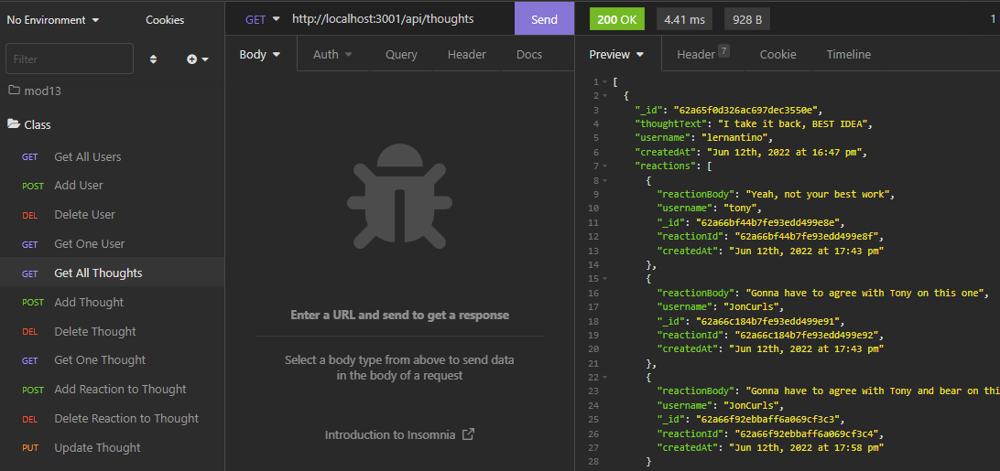

# **Social Network API**

## **Thumbnail**

## **Description**

- Allows the GET, POST, PUT, and DELETE of a user, thought, and reaction.

## **Built With**

- MongoDB
- Mongoose
- Javascript

## **Table of Contents**

- [Installation](#installation)
- [Usage](#usage)
- [License](#license)
- [Contributing](#contributing)
- [Testing](#testing)
- [Questions](#questions)
- [Deployment](#deployment)

## **Installation**

- Download from Github

## **Usage**

- See [demo](./assets/demo.mp4) or nodemon server || npm start

## **License**

- Unlicense

## **Contributing**

How to Contrubute

- Open Source baby!

## **Testing**

- n/a

## **Questions**

Made with ❤️💧🩸

- www.github.com/JonCurls

## **Deployment**

https://github.com/JonCurls/SoNetAPI
